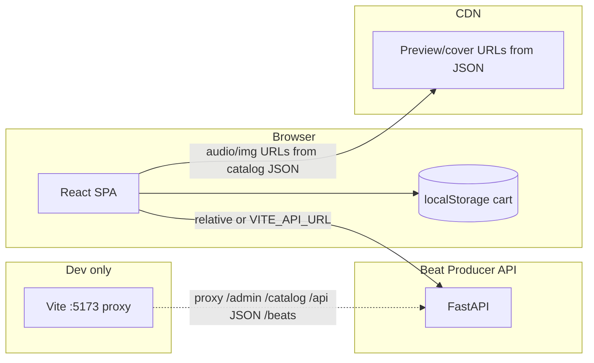
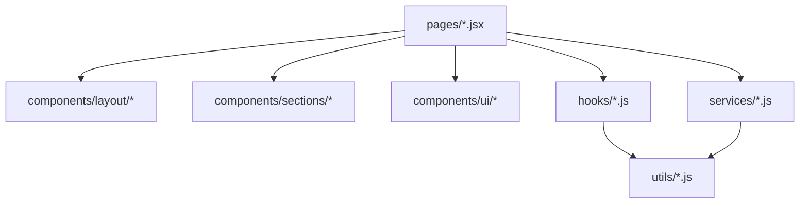
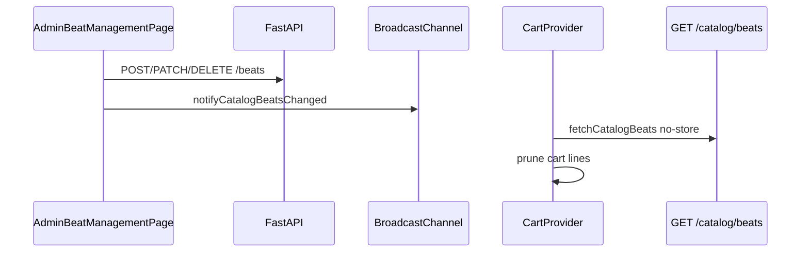

# Architecture — react-producer

## System context

**Production:** No Vite proxy; browser talks to API host via `VITE_API_URL` (or same-origin if reverse-proxied elsewhere).

## Layering inside the SPA

- **Pages** own route-level state (e.g. license modal selection).
- **Utils** hold reusable fetch/session/catalog logic **without** React.
- **`CartProvider`** wraps the app in `App.jsx` and renders **`CartDrawer`** as sibling to routed pages.

## Request flows

### Public catalog (no cookies)

1. `useCatalogBeats` → `fetchCatalogBeats()` → `fetch(apiUrl('/catalog/beats'), { headers: jsonAcceptHeaders })`.
2. Response JSON mapped through `apiBeatToDisplayBeat` (IDs, CDN URLs, license modal shape).

### Admin session check

1. `GET /admin/me` via `adminFetch` (credentials included).
2. `responseLooksLikeJson` prevents treating HTML shell as logged-in.
3. `isMeResponseBody` validates `{ email: string }`.

### Admin mutation with refresh

1. `adminFetch` runs request; on **401**, calls **`POST /admin/refresh`** once (deduped via `refreshInFlight`), then retries original request.
2. Paths **`/admin/login`** and **`/admin/refresh`** skip refresh recursion (`shouldTryRefresh`).

### Beat create/edit

1. `FormData` POST `/beats` or PATCH `/beats/:id` via `adminFetch` — browser sends multipart; **API** uploads to R2 (`AddBeatDialog.jsx` comment).

### Contact

1. `submitContact` → `POST /api/contact` with JSON body (no credentials).

## Vite dev proxy (critical)

Proxied prefixes: `/catalog`, `/beats`, `/api`, `/admin` → `127.0.0.1:8000`.

**Ambiguity resolution:**

- **`GET /beats`:** If path is exactly `/beats`, method GET, and **`Accept` includes `text/html`**, bypass returns **`/index.html`** so React route **`/beats`** (catalog page) loads. JSON API calls send `Accept: application/json` → forwarded to FastAPI.
- **`GET /admin/*`:** Only **`GET /admin/me`** goes to API; other **`GET /admin/...`** deep links return **`index.html`** so routes like `/admin/beat-management` work. Non-GET methods (e.g. login POST) always proxy.

This explains why **changing Accept headers** or path collisions can break routing.

## Event / sync flow

**Gap:** `useCatalogBeats` does not listen to `BroadcastChannel` — home/catalog UI may show stale data until remount or navigation.

## External integrations

- **FastAPI backend** — cookie auth, catalog, contact.
- **Google Fonts** — Inter + Material Symbols (`index.html`).
- **wavesurfer.js** — waveform binds to shared `<audio>` element from `beatPreviewPlayback.js` session.

## Service boundaries

| Boundary | Responsibility |
|----------|----------------|
| `adminFetch.js` | Credentialed fetch + refresh retry + cache policy for GET |
| `catalogBeatsApi.js` | Public catalog IO + display mapping + sync notifications |
| `contactService.js` | Validation + contact POST + status mapping |
| `beatPreviewPlayback.js` | Single active preview session + subscribers |

No Redux/React Query — manual `useEffect` fetch patterns.
